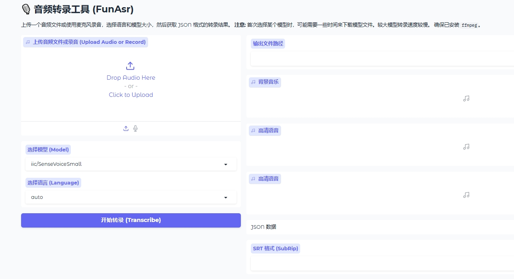

# funasr-webui
A gradio webui for FunAsr



# Install

- Install

```bash
git clone https://github.com/funasr/funasr-webui.git
cd  funasr-webui
```
You don't need to install anything else. Just download models and env files.

-  Download models and python(portable) environment files

Donwload models and python(portable) environments from [HERE](https://pan.quark.cn/s/9a8b52e4cd22) .
Decompress the downloaded file and put it in the same directory as the `start.bat` file.
Like this:

```
- models
- py312cuda124
- start.bat
```

- Run

```bash
start.bat
```
The WebUI will be started at http://127.0.0.1:7860/


# API Usage

```bash
pip install gradio_client
```

```python
from gradio_client import Client, handle_file

client = Client("http://127.0.0.1:7860/")
result = client.predict(
		audio=handle_file('https://github.com/gradio-app/gradio/raw/main/test/a-song.wav'),
		language="auto",
		model_dir="iic/SenseVoiceSmall",
		api_name="/process"
)
print(result)
```

